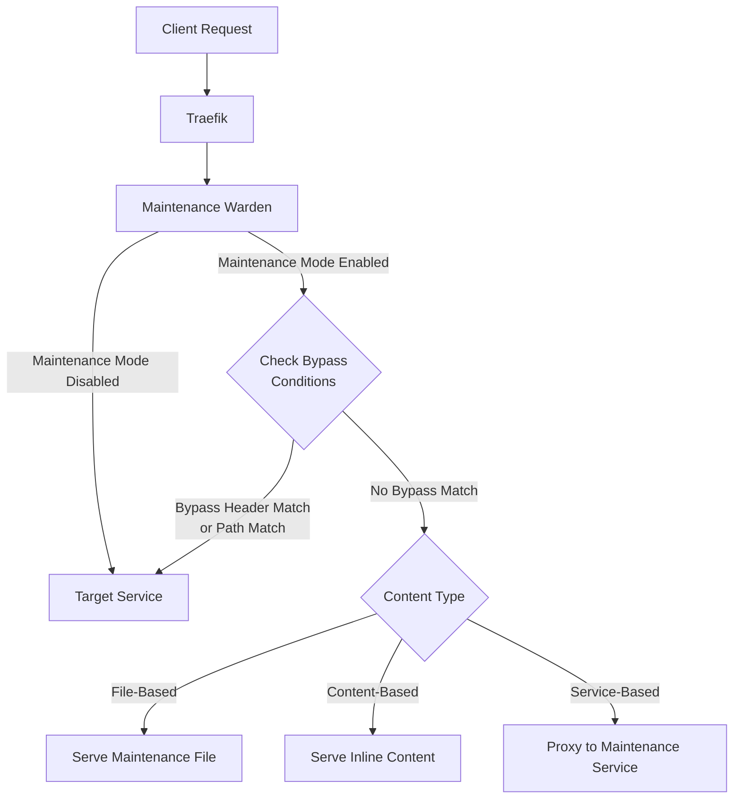

# Maintenance Warden: Technical Overview

## Architecture Overview

Maintenance Warden is a middleware plugin for Traefik that intercepts HTTP requests and conditionally redirects them to a maintenance page based on configurable criteria. The plugin is designed with a focus on performance, reliability, and flexibility.

### Core Components

1. **Request Interceptor**
   - Analyzes incoming HTTP requests
   - Checks for bypass conditions (headers, paths)
   - Makes routing decisions based on configuration

2. **Maintenance File Provider**
   - Reads and caches static HTML files
   - Monitors file changes for automatic reloading
   - Serves content with appropriate headers

3. **Maintenance Service Proxy**
   - Forwards requests to dedicated maintenance services
   - Handles timeouts and error conditions
   - Preserves request context where appropriate

4. **Bypass Mechanism**
   - Header-based bypass validation
   - Path-based bypass logic
   - Special case handling (e.g., favicon.ico)

### Data Flow

1. Request arrives at Traefik
2. Maintenance Warden middleware intercepts the request
3. If maintenance mode is disabled, request passes through to the target service
4. If maintenance mode is enabled:
   - Check for bypass header and value
   - Check for bypass path matches
   - If any bypass condition is met, pass to target service
   - Otherwise, serve maintenance content (file or service)

## Technical Features

### 1. Content Serving Modes

#### File-Based Maintenance
- **Implementation**: Direct file serving from disk
- **Performance**: High performance with minimal latency
- **Caching**: File content is cached in memory for efficiency
- **Change Detection**: Checks file modification times to auto-reload
- **Resource Usage**: Minimal memory footprint (~size of HTML file)

#### Content-Based Maintenance
- **Implementation**: Direct string content serving from configuration
- **Performance**: Highest performance with zero latency
- **Simplicity**: No file access or network required
- **Deployment**: Content directly embedded in configuration
- **Resource Usage**: Minimal memory footprint (only size of content string)

#### Service-Based Maintenance
- **Implementation**: HTTP reverse proxy to maintenance service
- **Flexibility**: Supports dynamic content generation
- **Timeout Handling**: Configurable timeouts with fallback
- **Protocol Support**: Preserves original request methods and headers
- **Error Handling**: Graceful fallback on service errors

### 2. Request Bypass Logic

#### Header-Based Bypass
- **Security**: Supports custom header names and values
- **Implementation**: Simple string comparison for performance
- **Flexibility**: Both header name and expected value are configurable

#### Path-Based Bypass
- **Implementation**: Prefix matching for efficiency
- **Use Cases**: Ideal for health checks, API status endpoints
- **Configuration**: Array of path prefixes to bypass

#### Special Cases
- **Favicon Handling**: Optional special case for favicon.ico requests
- **Implementation**: String suffix matching for performance

### 3. Response Management

#### Status Code Control
- **Implementation**: Configurable HTTP status code
- **Default**: 503 Service Unavailable (SEO-friendly for maintenance)
- **Headers**: Adds maintenance-specific headers automatically

#### Content Type Control
- **Implementation**: Configurable content type header
- **Default**: "text/html; charset=utf-8"
- **Flexibility**: Supports any valid content type

#### Response Headers
- **Retry-After**: Automatically added for better client behavior
- **X-Maintenance-Mode**: Status indicator for monitoring
- **Cache-Control**: Prevents caching of maintenance responses

### 4. Logging and Monitoring

#### Configurable Verbosity
- **Levels**: None (0), Error (1), Info (2), Debug (3)
- **Implementation**: Level-based filtering for efficient logging
- **Output**: Standardized log format with plugin identifier

#### Operational Events
- **Startup**: Configuration validation and startup information
- **File Loading**: Maintenance file loading status and size
- **Request Handling**: Request path and bypass decisions
- **Errors**: Detailed error information for troubleshooting

## Technical Requirements

### Minimum Requirements
- Traefik v2.4 or later
- Go 1.16 or later (for development)

### Resource Consumption
- **Memory**: Minimal (~1MB base + size of maintenance file if used)
- **CPU**: Negligible impact on request processing
- **Disk**: None for service-based, minimal reads for file-based

### Performance Characteristics
- **Latency**: <1ms overhead for bypass logic
- **Throughput**: Negligible impact on Traefik throughput
- **Scalability**: Linear scaling with request volume

## Integration Points

### Traefik Integration
- **Plugin Type**: Middleware (HTTP request modifier)
- **Configuration**: Both static and dynamic configuration supported
- **Application**: Can be applied globally or to specific routers

### Kubernetes Integration
- **CRD Support**: Compatible with Traefik IngressRoute and Middleware CRDs
- **Deployment**: Can be deployed as part of Traefik Helm chart
- **Configuration**: Supports ConfigMap-based maintenance file mounting

### Monitoring Integration
- **Metrics**: No additional metrics exposed currently
- **Logs**: Compatible with standard Traefik log processing
- **Tracing**: Preserves Traefik tracing context

## Implementation Details

### Performance Optimizations
- **File Caching**: Maintenance files are cached in memory
- **Mutex Usage**: Read-write mutex for efficient concurrent access
- **Prefix Matching**: Fast path matching with prefix comparison
- **Header Lookup**: Direct header lookup without regex

### Security Considerations
- **Header Value Storage**: Header values stored in plain text (consider secure storage for sensitive values)
- **File Access**: Limited to specified file path only
- **Service Access**: Limited to specified maintenance service only
- **Input Validation**: URL and configuration validation at startup 